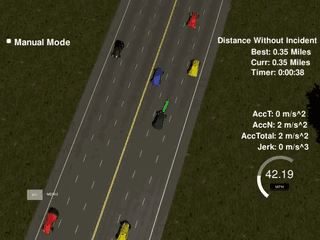
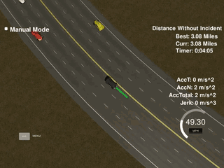
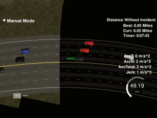
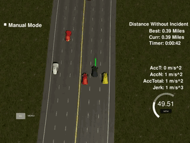
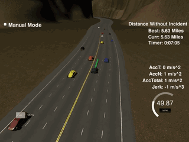
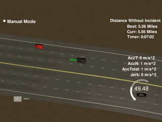
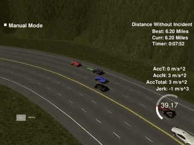
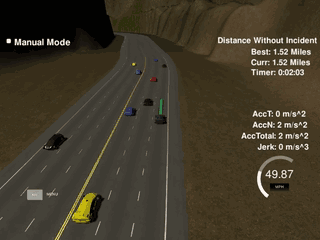

# Path Planning Project

This repository contains my solution for the project "Path Planning Project" of the Udacity Self-Driving Car Engineer Nanodegree Program. A description of a basic setup can be found in the

[original repository](https://github.com/udacity/CarND-MPC-Project).

The written code could be found in the files [main.cpp](./src/main.cpp), [vehicle.cpp](./src/vehicle.cpp), [lane.cpp](./src/lane.cpp), [road.cpp](./src/road.cpp) and their header files.

The following part of the README contains a short writeup which describes what is done.

---

In this project a path planner is implemented to drive a car around a track in a simulator. Waypoints of the road, the current position and the position of other cars are given. Based on these the planner should plan a path on the road and generate corresponding waypoints.

In the files [vehicle.cpp](./src/vehicle.cpp) and [lane.cpp](./src/lane.cpp) the basic properties of a vehicle and of a lane are implemented. The lane mainly contains a list of cars and calculates things like their speed or the next and previous car in that lane.

The file [road.cpp](./src/road.cpp) implements everything that happens on the road. It has lanes with cars and calculates waypoints for every lane for a given car. Over all calculated waypoints it finds the best option based on a cost function which takes things like speed, distance to the fastest lane or a lane change into account.

These waypoints are the interpolated by the spline library to generate some smooth waypoints to output.

Here are some GIFs to show how it works!

The planner handles strong breaks from cars in front of it very well without collision:

The planner is able to change into a slower lane with the goal to get in the fastest lane. Here the car moves from the left lane into the slower middle lane to get to the right lane, in which no car is:

The planner handles lane changes of other cars well:

Here the planner correctly waits till the cars in the left lane have passed until it tries to change into it:

The planner waits till there is enough space to the car behind it in the new lane before it changes in that lane:

# Build & Run

### Dependencies

* cmake >= 3.5
* make >= 4.1 (Linux, Mac), 3.81 (Windows)
* gcc/g++ >= 5.4

### Basic Build Instructions

1. Clone this repo.
2. Make a build directory: `mkdir build && cd build`
3. Compile: `cmake .. && make`
4. Run it: `./mpc`
